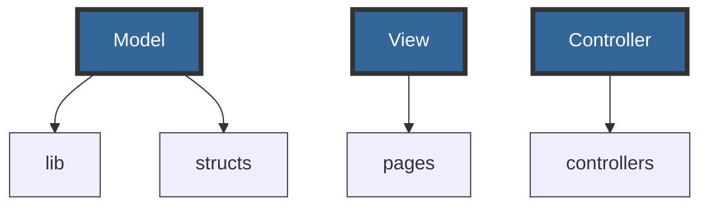

# Organizing your app's code

Genie Framework is flexible in terms that you can organize your code as you see fit. However, there are best practices in web development that will make it easier to maintain the code and gradually add new features. Moreover, there are features such as automatic asset loading that require a specific structure.

This guide will show you several organization patterns that you can use according to your needs.

### All in one

This is the simplest case in which all code for the web app is placed in a single file. In it, any external code is imported, and the routes, their handlers and views are defined. This is what it would look like on the filesystem:

```
.
├── app.jl
├── public/
│   ├── style.css
│   ├── meta.png
│   └── fig.png
└── lib/
    └── StatisticAnalysis.jl
```
All the app's logic is contained in `app.jl`, whereas the `public` folder contains static assets such as images or stylesheets, and the `lib` folder contains code that is used by the app. Then, `app.jl` would look like this:


```julia
module App
using GenieFramework
include("lib/StatisticAnalysis.jl")
import StatisticAnalysis
@genietools

route("/analysis") do
    x = StatisticAnalysis.gen_numbers(20)
    m = StatisticAnalysis.calc_mean(x)
    "The mean is $m"
end

route("/display") do
    "<h1>Results figure</h1> "
end

end
```

### MVC architecture

The model-view-controller (MVC) architecture is very common in web development as it provides a clear separation of concerns to o ensure organized, scalable, and maintainable code. In it, the code is organized into three main components:

- **Model**: represents the data, data operations, and data processing code of the application.
- **View**: the UI of the app which displays the data to the user and sends the user commands to the controller.
- **Controller**: the glue between the model and the view. It takes the user input from the view, processes it (with potential updates to the model), and decides what to display or which view to render.




When following the MVC pattern, a Genie app has this file structure:

```bash
.
├── app.jl
├── lib
├── structs
├── controllers
└── pages

```

In this template, the `app.jl` file is the entry point to the app. Then, the `lib` folder holds the code performing calculations and data processing, and `structs` contains definitions of the data objects used in the app and the database; this constitutes the model. Next, `controllers` contains the code for the controllers that handles requests and responses, `pages` contains the code for the views.

To see an example of an MVC app, check out the [Writing your first app](/guides/writing-your-first-app) guide.

