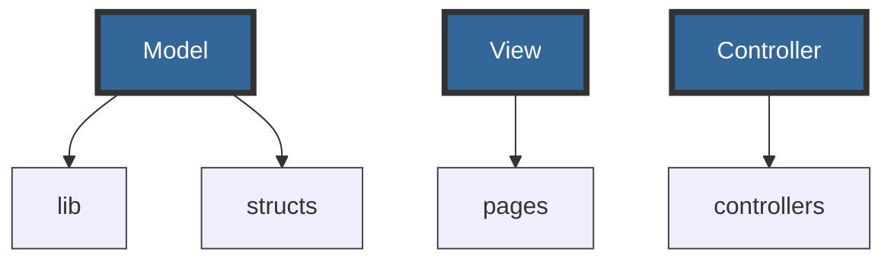
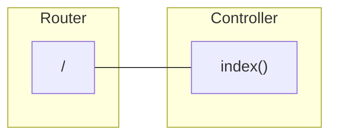
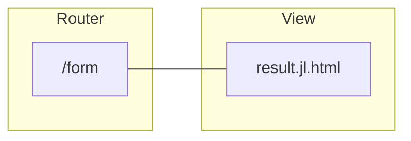
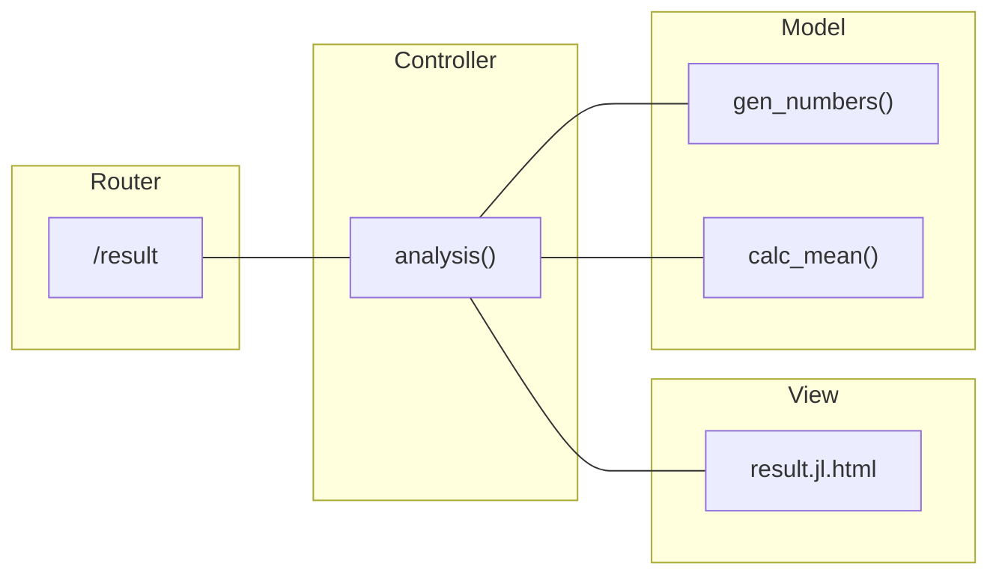

# Your first Genie app

The general assumption in Genie apps is that you have some code performing scientific computations and want to share it online. With Genie Framework, you can encapsulate your code into a web app, making it readily available and interactive for users via a web browser.

This guide will show you how to create a simple app with a page in which the user can enter a value and trigger a computation, with the result being displayed afterwards. In particular, the app will take a value `N`, generate `N` random numbers, and return their mean as in this preview:


### Structuring the code

Genie Framework adheres to the model-view-controller (MVC) architecture, which means that the code is organized into three main components:

- **Model**: represents the data, data operations, and data processing code of the application.
- **View**: the UI of the app which displays the data to the user and sends the user commands to the controller.
- **Controller**: the glue between the model and the view. It takes the user input from the view, processes it (with potential updates to the model), and decides what to display or which view to render.

By default, a Genie app has the following file structure:

```bash
.
├── app.jl
├── lib
├── structs
├── controllers
└── pages

```

In this template, the `app.jl` file is the entry point to the app. Then, the `lib` folder holds the code performing calculations and data processing, and `structs` contains definitions of the data objects used in the app and the database; this constitutes the model. Next, `controllers` contains the code for the controllers that handles requests and responses, `pages` contains the code for the views.



Since Genie Framework is pretty flexible, you're free to use this structure or extend it for your needs. In this first example, we'll follow the template without the `structs` folder as we won't be using databases.

### Adding your Julia code

Any local Julia modules or packages to be used in the app should be placed in the `lib` folder. In this example, we have a `StatisticAnalysis` module with functions to generate `N` random numbers and calulate the mean. This is the content of the `StatisticAnalysis.jl` file to be placed in `lib`:

```julia
module StatisticAnalysis

export gen_numbers, calc_mean

function gen_numbers(N::Int)
    return rand(N)
end

function calc_mean(x::Vector{Float64})
    return round(sum(x) / length(x); digits=4)
end
end
```

Then, import the module in the main file as

```julia
module App
using GenieFramework
include("lib/StatisticAnalysis.jl")
using .StatisticAnalysis

end

```

Now that you've set up the computational code, it's time to add the pages to trigger it and display the results.

### Welcome page

Let's start with a simple index page to be accessed via the browser at the root `/` path. To add a page, three element are needed:

- A function in the controller to handle the request sent to the path `/` from the client's browser.
- A view with the information to be rendered.
- A route to connect the two.



Create a new module `AnalysisController` in `controllers` contained in a file `AnalysisController.jl`. For a simple index page, we'll have the controller implement the view directly in an `index` function that will return a welcome message and a link to the number input form.

```julia [AnalysisController.jl]
module AnalysisController

function index()
    html("<h4>Welcome to the number analysis module</h4>
          <a href=/form>Numbers form</a>")
end

end

```

Next, import the controller into `app.jl` and add a route that connects the `/` path to the `index` function.


```julia [app.jl]
module App
using GenieFramework
include("lib/StatisticAnalysis.jl")
include("controllers/AnalysisController.jl")
using .StatisticAnalysis
using .AnalysisController

route("/", AnalysisController.index)

end

```

When you run the app, you should see index page linking to the form, which we will implement next.

### Number input form

<div>

</div>
In the second page, we want to have an input field to introduce the length of the vector of random numbers, with a submit button to send the information to the server. This can be done with a standard HTML `form`:

```html [form.jl.html]
<form action="/result" method="POST" enctype="multipart/form-data">
    <input type="number" name="N" value="" placeholder="How many numbers?" />
    <input type="submit" value="Send" />
</form>
```
The `form` takes as arguments `action` and `method`. The `action` parameter specifies the path to which the form data will be sent, and the `method` specifies the HTTP method to be used. In this case, we'll use `POST` as we want to send the data enclosed in the body of the HTTP request. An alternative would be `GET`, with the data being appended to the URL.

Inside the form, the input elements serve as the interactive fields where users can enter or select information. Each input element has a `type` attribute which specifies the kind of input it represents, and the `value` that will be sent to the server. Note that the input box has blank value as it'll be filled in by the user.


For simple pages like this one displaying a form, there is no need to implement a controller function. Thus, add the following route to `app.jl` that will render the view:

```julia
route("/form") do
    html(Renderer.filepath("pages/form.jl.html"))
end
```

### Results page

<div>

</div>

First, add a function in the controller to handle the form and perform the numerical analysis with the received data. The code below adds some new imports and implements the `analysis` function for this purpose.

```julia
module AnalysisController
using GenieFramework.Genie.Renderer.Html
using GenieFramework.Genie.Requests
using .Main.App.StatisticAnalysis

function index()
    html("<h4>Welcome to the number analysis module</h4>
          <a href=/form>Numbers form</a>")
end

function analysis()
    N = parse(Int, postpayload(:N))
    x = gen_numbers(N)
    m = calc_mean(x)
    html(Renderer.filepath("pages/results.jl.html"), N=N, m=m)
end

end

```

In `analysis`, the `postpayload` call from the `Genie.Requests` module extracts the value of `N` from the request submitted by the form. Then, the analysis is performed and a response with the result is rendered. This response page is implemented via the HTML view `analysis.jl.html`, whose contents are:


```html
<!DOCTYPE html>
<html lang="en">

<head>
    <meta charset="utf-8" />
    <title>Number analysis</title>
</head>

<body>
    <div class="container">
        The mean of $N random numbers is: $m
    </div>
</body>
</html>
```

Note that we pass `N` and `m` to the `html` renderer, as these variables are to be displayed in the view with the standard Julia interpolation syntax `$`.

Finally, add a POST route linking the `/result` path to the `analysis` function. Note that it must bet a `POST` route as the form data is sent via the HTTP body.

```julia
module App
using GenieFramework
include("lib/StatisticAnalysis.jl")
include("controllers/AnalysisController.jl")
using .StatisticAnalysis
using .AnalysisController

route("/", AnalysisController.index)

route("/form") do
    html(Renderer.filepath("pages/form.jl.html"))
end

route("/result", AnalysisController.analysis,  method=POST)

end

```
