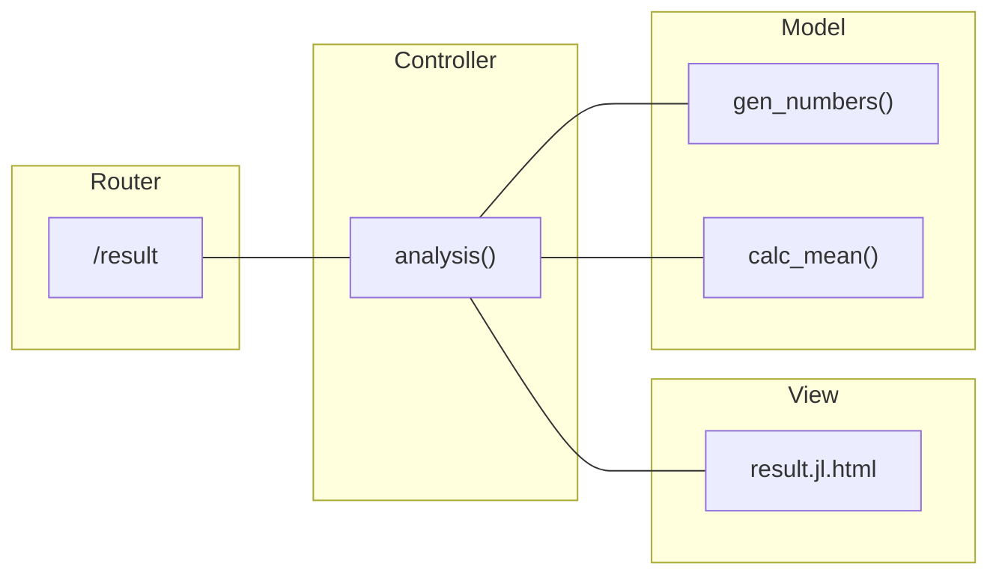

# Your first Genie app

The general assumption in Genie apps is that you have some code performing scientific computations and want to share it online. With Genie Framework, you can encapsulate your code into a web app, making it readily available and interactive for users via a web browser.

This guide will show you how to create a simple app with a page in which the user can enter a value and trigger a computation, with the result being displayed afterwards. In particular, the app will take a value `N`, generate `N` random numbers, and return their mean as in this preview:


### Running the app

Start with an empty project folder and create a file `app.jl`, which will be the entry point to the app, with the following content:

```julia
module App
using GenieFramework
@genietools

end
```
The `GenieFramework` package includes everything you'll need to build the web app, and the `@genietools` macro enables features such as logging. To launch the app, start a Julia REPL with `julia --project` in the project folder and run

```julia
using GenieFramework; Genie.loadapp(); up()
```

This will start a server on port `8000` and you can access the app at `localhost:8000`. To stop the server, execute `down()` in the REPL.

### Adding your Julia code

Any local Julia modules or packages to be used in the app should be placed in the `lib` folder, whose content is automatically loaded by the server. In this example, we have a `StatisticAnalysis` module with functions to generate `N` random numbers and calulate the mean. Create the `lib` folder, and in it place a `StatisticAnalysis.jl` file with

```julia [lib/StatisticAnalysis.jl]
module StatisticAnalysis

export gen_numbers, calc_mean

function gen_numbers(N::Int)
    return rand(N)
end

function calc_mean(x::Vector{Float64})
    return round(sum(x) / length(x); digits=4)
end
end
```

Then, import the module in the main file as

```julia [app.jl] {3,4}
module App
using GenieFramework
include("lib/StatisticAnalysis.jl")
using .StatisticAnalysis

end

```
This is what the file structure should look like so far:

```
.
├── app.jl
└── lib/
    └── StatisticAnalysis.jl
```

Now that you've set up the computational code, it's time to add the pages to trigger it and display the results.

### Welcome page

Let's start with a simple index page at the root `/` path with a link to the number input form. You can create it with a route, which takes a as an argument a function that returns the content of the page:


```julia [app.jl] {6-9}
module App
using GenieFramework
include("lib/StatisticAnalysis.jl")
using .StatisticAnalysis

route("/") do
    html("<h4>Welcome to the number analysis module</h4>
          <a href=/form>Numbers form</a>")
end

end

```

When you run the app, you should see the page at `http://localhost/`.

### Number input form

The second page will have a form with an input field to introduce the length of the vector of random numbers, with a submit button to send the information to the server. For this page, create a `pages` folder and in it a `form.jl.html` file with the following content:

```html [pages/form.jl.html]
<form action="/result" method="POST" enctype="multipart/form-data">
    <input type="number" name="N" value="" placeholder="How many numbers?" />
    <input type="submit" value="Send" />
</form>
```
The `action` parameter in the `form` element specifies the path to which the form data will be sent, and `method` specifies the HTTP method. We'll use `POST` to send the data enclosed in the body of the HTTP request. An alternative would be `GET`, with the data being appended to the URL as `/result?N=[value]`.

Inside the form, the `number` type input will show as an input box, whereas the `submit` type input will appear as the button that submits the form. Note that the input box has blank value as it'll be filled in by the user.

Now, check that the project structure matches this:
```
.
├── app.jl
├── lib/
└── pages/
    └── form.jl.html
```
Finally, add a route to `app.jl` with a call to the `html` function that will render the view file:

```julia [app.jl]
route("/form") do
    html(Renderer.filepath("pages/form.jl.html"))
end
```

### Results page

Since the Results page gets the input data from the form and displays the analysis result, it requires some logic to handle the request. Therefore, we'll adopt the [model-view-controller (MVC) architecture](/guides/organizing-your-code), which cleanly separates the logic from the UI design by splitting the code into three components:

- **Model**: represents the data, data operations, and data processing code of the application.
- **View**: the UI of the app, which displays the data to the user and sends the user commands to the controller.
- **Controller**: the glue between the model and the view. It takes the user input from the view, processes it (with potential updates to the model), and decides what to display or which view to render.

Following the MVC organization, the Results page requires
- A controller function `analysis()` to handle the form data and render the view.
- A view file `result.jl.html` to display the result.
- A route `/result` to connect the two.

<div>

</div>

First, create a the `controllers` folder. In it, add a file with the `AnalysisController` module containing an `analysis` handler function.

```julia [controllers/AnalysisController.jl]
module AnalysisController
using GenieFramework
using GenieFramework.Genie.Requests
using .Main.App.StatisticAnalysis

function analysis()
    N = parse(Int, postpayload(:N))
    x = gen_numbers(N)
    m = calc_mean(x)
    html(Renderer.filepath("pages/result.jl.html"), N=N, m=m)
end
end

```

In `analysis`, the `postpayload` call from the `Genie.Requests` module extracts the value of `N` from the request submitted by the form. Then, the analysis is performed and a response with the result is rendered. Note that `N` and `m` are passed to the `html` renderer, as these variables are to be displayed in the view.

The response page is implemented via the HTML view `result.jl.html`, whose contents are:

```html [result.jl.html]
<!DOCTYPE html>
<html lang="en">

<head>
    <meta charset="utf-8" />
    <title>Number analysis</title>
</head>

<body>
    <div class="container">
        The mean of $N random numbers is: $m
    </div>
</body>
</html>
```
This page implements the typical HTML page structure, with a header to set parameters such as language or title, and a body. Still, as seen in the views for the index and forms, the specification of a header and body is not necessary.

This is what the file structure should look like now:
```
.
├── app.jl
├── lib
│   └── StatisticAnalysis.jl
├── controllers
│   └── AnalysisController.jl
└── pages
    ├── form.jl.html
    └── result.jl.html
```


Finally, add a POST route linking the `/result` path to the `analysis` function. Note that it must bet a `POST` route as the form data is sent via the HTTP body.

```julia
module App
using GenieFramework
include("lib/StatisticAnalysis.jl")
include("controllers/AnalysisController.jl")
using .StatisticAnalysis
using .AnalysisController

route("/") do
    html("<h4>Welcome to the number analysis module</h4>
          <a href=/form>Numbers form</a>")
end

route("/form") do
    html(Renderer.filepath("pages/form.jl.html"))
end

route("/result", AnalysisController.analysis,  method=POST)

end

```
