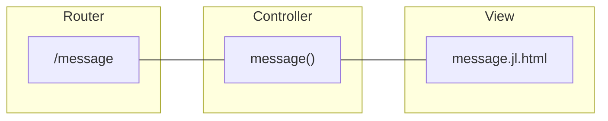

# Adding dynamic pages

Modern web applications are often characterized by their ability to generate content dynamically, tailoring web pages based on user interactions, database queries, or other factors. This guide provides an overview of how to create web pages with dynamic content.

Dynamic content refers to the parts of a web page that change based on varying factors such as user input, database changes, or real-time data. Instead of serving static HTML files, the server generates the content of the page on-the-fly, often pulling from databases or other data sources.

###

To add a new page to an app, you need the following:

- A view defining the information to be displayed in the browser.
- A controller to handle the logic behind the view.
- A route to connect the page's URL path to the controller and view.


### Pages in a route

For simple pages displaying short messages or static content, you can add the page directly in the route definition with the `do` `end` syntax:

```julia
using GenieFramework
route("/message") do
    "<h1>Welcome to Genie!</h1>"
end
```
The string passed to `route` must be valid HTML in order to be properly rendered in the browser.

If the page includes dynamically generated content you can include it with the `html` renderer and the `$` operator for string interpolation:

```julia
using GenieFramework.Genie.Renderer.Html
msg = "Welcome to Genie!"
route("/message") do
    html("Today's message is $msg")
end

```

Finally, you can define the page's HTML code in a file and include it as

```julia
using GenieFramework.Genie.Renderer.Html
route("/message") do
    html(Renderer.filepath("pages/message.jl.html"))
end

```

```html [message.jl.html]
<h1>Welcome to Genie!</h1>
```


### Pages with a controller

When pages grow in complexity, it is recommended to separate the logic from the view and define a controller. This allows you to keep the code organized and the logic reusable.



Following the model-view-controller (MVC) architecture, your app's files should be organized like this

```
.
├── app.jl
├── controllers/
└── pages/

```
where `app.jl` is the app's entry point.

```julia [app.jl]
module App
using GenieFramework
@genietools

#route definitions go here
end

```

To add a page, create a new controller in `controllers` with a handler function that will perform any calculations or data analysis necessary and return the rendered page. In the call to the `html` renderer, pass as parameters the variables to be displayed in the page.

```julia [MessageController.jl]
module MessageController
using GenieFramework.Genie.Renderer.Html
using Dates

function message()
    current = Dates.now()
    tomorrow = current + Dates.Day(1)
    html(Renderer.filepath("pages/message.jl.html"), current=current, tomorrow=tomorrow)
end

end
```

Then, add the page's code.

```html [message.jl.html]
Today's date and time: $current
Tomorrow's date and time: $tomorrow
```

You can also write the page's full code with its header and body, so that you can include external CSS or Javascript files and set some of the page's parameters.

```html [message.jl.html]
<!DOCTYPE html>
<html lang="en">

<head>
    <meta charset="utf-8" />
    <title>Number analysis</title>
</head>

<body>
    <div class="container">
        Today's date and time: $current
        Tomorrow's date and time: $tomorrow
    </div>
</body>

</html>

```

The last step is adding a route in `app.jl` linking the page's path to its controller function.

```julia [app.jl]

module App
using GenieFramework
include("controllers/MessageController.jl")
using .MessageController
@genietools

route("/message", MessageController.message)
end
```

### Executing Julia code in a page

It is possible to embed Julia code in a page's code that will be executed when the page is loaded. To do so, use the `$` interpolation operator to wrap Julia code as

```html
<p>1+1 is: $(1+1)</p>
```

To include multiline code blocks, use the `<%` and `%>` delimiters as

```html
<p>
    <% for i in 1:3 %>
    $i
    <% end %>
</p>
```
Remember to always pass any variable to be printed to the `html` renderer.

### Including static assets

To displayed static assets such as images, or include assets in the head of a page, place them first in the `public` folder. They will be automatically picked up by the server and served at the root path `/`. Then, the assets can be included in any page like in the example below.


```
.
├── app.jl
├── public/
│   ├── style.css
│   ├── meta.png
│   └── fig.png
├── controllers/
└── pages/
    └── index.jl.html
```

```html

<!DOCTYPE html>
<html lang="en">

<head>
    <meta charset="utf-8" />
    <meta name="og:image" content="/meta.png" />
    <link rel="stylesheet" href="/style.css" />
    <title>Including assets</title>
</head>

<body>
        
</body>

</html>
```


