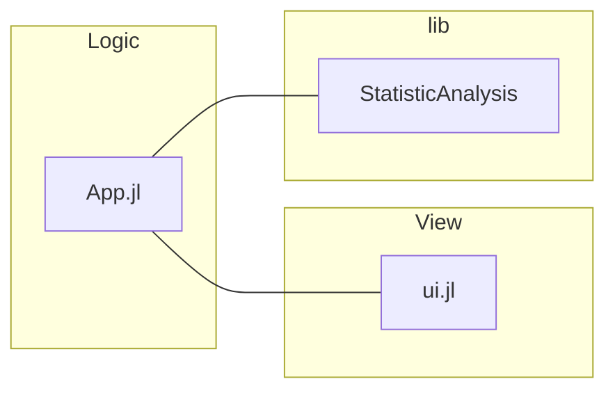

# Creating your first dashboard

A dashboard is a type of reactive app that displays data visualizations and allows the user to interact via controls such as buttons or sliders. With each user interaction, the application responds by executing code that manipulates the underlying data and promptly reflects these changes in the user interface. All of this happens in real time, without the need to reload the page.


This guide will show you how to create a dashboard which displays statistics about a vector of random numbers, and allows the user to change the length of the vector. The code will rely mainly on the reactive UI features implemented by the `Stipple.jl` package, which is already included in the `GenieFramework.jl` metapackage.


### Project structure

When building a Genie app, the usual assumption is that you already have some code performing some data analysis that you want to turn into a web app. For this demo, we'll start with a `StatisticalAnalysis` module  with the following content:


```julia [StatisticalAnalysis.jl]
module StatisticAnalysis

export gen_numbers, calc_mean

function gen_numbers(N::Int)
    return rand(N)
end

function calc_mean(x::Vector{Float64})
    return round(sum(x) / length(x); digits=4)
end
end
```
Create a project folder for the demo app, and in it create a `lib/` folder and place the `StatisticAnalysis.jl` file inside it. The contents of this folder will be automatically loaded into the `Main` module when the app is run.

Next, we have the `App.jl` file which is the main entry point to the app. It will import the data analysis code and implement the logic to control the UI. Create the file in the project root with this content:

```julia [App.jl]
module App
using Main.StatisticAnalysis
using GenieFramework
@genietools

end
```
We'll define the user interface in a `ui.jl` file in the root. It'll be empty until we start writing the UI code, so for now just create an empty file running `touch ui.jl` in the terminal or `touch("ui.jl")` in the REPL.

This is what the files structure should look like:

```
├── App.jl
├── ui.jl
└── lib
    └── StatisticAnalysis.jl
```




To launch the app, run this in the Julia REPL:

```julia
using GenieFramework; Genie.loadapp(); up()
```

A server will start on port `8000`, and you can access the app at `https://localhost:8000`. To stop the server, execute `down()` in the REPL.


### App.jl logic template

For the logic in `App.jl`, we'll use the following template:

```julia [App.jl]
module App
using Main.StatisticAnalysis
using PlotlyBase
using GenieFramework
@genietools

@app begin
    #reactive code goes here
end

@page("/", "ui.jl")
end
```

The code is divided into three parts: 
- Imports of `GenieFramework`, `PlotlyBase` and the data analysis code in `StatisticAnalysis.jl`.
- Reactive code within the `@app` block to control dashboard interactivity.
- Route definition with `@page` to link a URL with a view file.

Let's now add the reactive code and UI code to implement the following:

- A slider to control the length of the vector of random numbers.
- A badge to display the vector's mean.
- A histogram plot for the vector.

### Slider and mean - logic

When the slider is moved, we want to set a new value for the vector length and show the updated mean. To this end, first declare a reactive variable `N` in the  `@app` block as:

```julia [App.jl]
@app begin
   @in N = 0
end
```
Tagging with `@in` makes the variable reactive and writeable from the UI. Whenever its value changes in the UI in the browser, the change will be automatically propagated to the Julia code. Likewise, any change in the Julia code will be propagated to the UI.

Next, add a read-only output variable to hold the value of the mean:

```julia [App.jl]
@out m = 0.0
```
Variables tagged with `@out` can only be modified from the Julia code. Any change made in the browser will not be propagated to the backend. Note that reactive variables must always be initialized to a value of the appropriate type.

Finally, use the `@onchange` macro to declare a reactive handler that generates a new vector and calculates its mean when `N` changes:
 
```julia [App.jl]
@app begin
    @in N = 0
    @out m = 0.0
    @onchange N begin
        x = gen_numbers(N)
        m = calc_mean(x)
    end
end

```

Using the `@in`, `@out` and `@onchange` you can implement all kinds of interactivity in an easy manner. To learn more, check out the [Reactivity](/reference/reactivity) reference. 

Now, it's time to bind the reactive code to UI components.

### Slider and mean - UI

You can build the UI in pure Julia using the low-code API provided by the `StippleUI.jl` package, which is automatically included upon `using GenieFramework`. This provides multiple calls such as `textfield` or `slider` that generate the HTML code for the UI component.

```julia
julia> slider(1:1:1000, :N)
"<q-slider :min=1 v-model=\"N\" :max=1000 :step=1></q-slider>"

```
The reactive components generated by the API, identified with the `q-` prefix, are Vue.js components from the [Quasar](https://quasar.dev/vue-components/) framework.


To incorporate the slider component and the mean display into the UI, add the following code to `ui.jl`:
```julia [ui.jl]
row([
    cell(class="st-col col-3", [
        h1("A simple dashboard"),
        slider(1:1000, :N),
        p("The average of {{N}} random numbers is {{m}}", class="st-module"),
    ])
])
```
This defines the page layout with a `row`, and a `cell` with the `st-col, col-3` CSS classes to set its column width. Inside the cell, a header, slider and paragraph are displayed.

The `slider` component is bound to `N` by using its symbol name `:N`. The `{{variable}}` syntax is used in the paragraph `p` to display the content of reactive variables. Moreover, this syntax accepts any valid Javascript expression, so you can write things like `{{m.toFixed(2)}}` to display the mean with two decimals.

### Histogram plot

The plotting interface is implemented by the `StipplePlotly` package, which accepts objects from Plotly's `PlotlyBase` package to define its plots. A Plotly plot consists of two parts: a trace, containing the information to be plotted, and a layout, setting the style of the plot and other aspects such as title or axis labels. For more details on plotting, see the [Plotting](/reference/plotting) reference page. 

First, declare an empty histogram trace and the layout variable as
```julia [App.jl]
@out trace = [histogram(x=[])]
@out layout = PlotlyBase.Layout(title="Histogram plot")
```

Then, add the code to update the trace in the reactive handler when `N` changes

```julia [App.jl]
trace = [histogram(x=x)]
```
This is the final reactive code in `App.jl`:

```julia [App.jl]
@app begin
    @in N = 0
    @out m = 0.0
    @out trace = []
    @out layout = PlotlyBase.Layout(title="Histogram plot")
    @onchange N begin
        x = gen_numbers(N)
        m = calc_mean(x)
        trace = [histogram(x=x)]
    end
end
```

To display the plot in the UI, add the following call to the `cell` in `ui.jl`:
```julia
plot(:trace, layout=:layout)
```
This is what the final UI code looks like:
```julia [ui.jl]
row([
    cell(class="st-col col-3", [
        h1("A simple dashboard"),
        slider(1:1000, :N),
        p("The average of {{N}} random numbers is {{m}}", class="st-module"),
        plot(:trace, layout=:layout)
    ])
])
```

To see the HTML that is generated and rendered in the browser, paste the `ui.jl` code in the REPL and you'll obtain this:

```html
<div class="row">
    <div class="st-col col st-col col-3">
        <h1>A simple dashboard</h1>
        <q-slider :min=1 v-model="N" :max=1000 :step=1></q-slider>
        <p class="st-module">The average of {{N}} random numbers is {{m}}</p>
        <plotly :data="trace" :layout="layout" :displaylogo="false"></plotly>
    </div>
</div>
```

If you prefer it, you can use HTML to define the UI. Just put the code in a `ui.jl.html` file and change the route to include it with `@page("/", "ui.jl.html")`

And that's it, you've finished your first dashboard! You can continue reading the guides to add more features such as [multiple pages](/guides/adding-reactive-pages) or an [API](/guides/creating-an-API).
