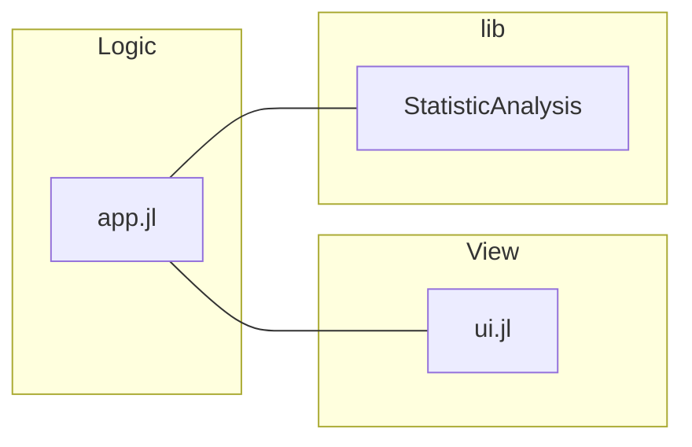

# Creating your first dashboard

A dashboard is a type of reactive app that displays data visualizations and allows the user to interact via controls such as buttons or sliders. With each user interaction, the application responds by executing code that manipulates the underlying data and promptly reflects these changes in the user interface. All of this happens in real time, without the need to reload the page.

The components of a reactive application can be divided into four categories:

- **Data analysis**: code performing the computations and transformations that process and analyze the data.

- **Reactive variables**: variables that monitor their own value for any changes. Once a change is detected, they relay this change throughout the application to ensure all components are updated.

- **Reactive handlers**: code snippets that respond to changes in a reactive variable.

- **UI components**: the elements in the browser with which users interact. Can be bound to a reactive variable with two-way synchronization, so that changes in the UI are instantly reflected in the associated reactive variables and vice versa.

This guide will show you how to create a dashboard which displays statistics about a vector of random numbers, and allows the user to change the length of the vector. The code will rely mainly on the reactive UI features implemented by the `Stipple.jl` package, which is already included in the `GenieFramework.jl` metapackage.


### Project structure

We'll divide the code for the app into 3 files:
- `app.jl`: main entry point to the app, also contains the app's logic to control the UI
- `ui.jl`: implements the UI .
- `StatisticAnalyis.jl`: contains the code to analyze the data.


This is the final organization in the file system:

```
├── app.jl
├── ui.jl
└── lib
    └── StatisticAnalysis.jl
```
This type structure is sufficient for a simple dashboard. When moving into more complex apps with multiple pages and other features like database access, it is recommended that you use the [MVC architecture](/guides/organizing-your-code). See the [Your first app](/guides/writing-your-first-app) guide for an example of a MVC app.

### Running the app

To launch the app, start a Julia REPL with `julia --project` in the project folder and run

```julia
using GenieFramework; Genie.loadapp(); up()
```

This will start a server on port `8000` and you can access the app at `localhost:8000`. To stop the server, execute `down()` in the REPL.

### Adding your julia code

When building a Genie app, the usual assumption is that you already have some code performing some data analysis that you want to turn into a web app. In this case, the `StatisticalAnalysis` module in `lib` would be your pre-existing code, with the following content:


```julia [lib/StatisticalAnalysis.jl]
module StatisticAnalysis

export gen_numbers, calc_mean

function gen_numbers(N::Int)
    return rand(N)
end

function calc_mean(x::Vector{Float64})
    return round(sum(x) / length(x); digits=4)
end
end
```


### App logic

The `app.jl` file contains the logic controlling user interaction and UI updates, and also route definitions. That is, any code not related to data processing or UI definition. Create an `App` module in `app.jl` with the following content:

```julia [app.jl]
include("lib/StatisticAnalysis.jl")
using .StatisticAnalysis
using PlotlyBase
using GenieFramework
@genietools

@app begin
    #reactive code goes here
end

@page("/", "ui.jl")
```

The app's logic is divided in the following parts: 
- Imports of `GenieFramework`, `PlotlyBase` and the data analysis code in `StatisticAnalysis.jl`.
- Reactive code within the `@app` block.
- Route definition with `@page`.

Let's now add the reactive code to implement the following:

- A slider to control the length of the vector of random numbers.
- A badge to display the vector's mean.
- A histogram plot for the vector.

For the slider, use the `@in` macro to declare an input variable that captures the vector length `N`:

```julia
@app begin
   @in N = 0
end
```
Tagging with `@in` makes the variable writeable from the UI. Whenever its value changes in the UI in the browser, the change will be automatically propagated to the Julia code. Likewise, any change in the Julia code will be propagated to the UI.

Next, add a read-only output variable to display the mean:

```julia
@out m = 0.0
```
Note that reactive variables must always be initialized to a value of the appropriate type.

We'll use Plotly for the histogram plot, provided by the `PlotlyBase` package. A Plotly plot consists of two parts: a trace, containing the information to be plotted, and a layout, setting the style of the plot and other aspects such as title or axis labels. For more details on plotting, see the [Plotting](/reference/plotting) reference page. Now, declare an empty trace and the layout variable as
```julia
@out trace = []
@out layout = PlotlyBase.Layout(title="Histogram plot")
```

Finally add a reactive handler with the `@onchange` macro to generate the vector and update the mean and histogram when `N` changes:
```julia [app.jl] {6-10}
@app begin
    @in N = 0
    @out m = 0.0
    @out trace = []
    @out layout = PlotlyBase.Layout(title="Histogram plot")
    @onchange N begin
        x = gen_numbers(N)
        m = calc_mean(x)
        trace = [histogram(x=x)]
    end
end
```

This is it for the app's logic. Using the `@in`, `@out` and `@onchange` you can implement all kinds of interactivity in an easy manner. To learn more, check out the [Reactivity](/reference/reactivity) reference.


### User interface

You can build the UI in pure Julia using the low-code API provided by the `StippleUI.jl` package, which is automatically included upon `using GenieFramework`. This provides multiple calls such as `textfield` or `slider` that generate the HTML code for the UI component.

```julia
julia> slider(1:1:1000, :N)
"<q-slider :min=1 v-model=\"N\" :max=1000 :step=1></q-slider>"

```
The reactive components generated by the API, identified with the `q-` prefix, are Vue.js components from the [Quasar](https://quasar.dev/vue-components/) framework.


To build the UI for the demo app, add the following code to `ui.jl`:
```julia [ui.jl]
row([
    cell(class="st-col col-3", [
        h1("A simple dashboard"),
        slider(1:1000, :N),
        p("The average of {{N}} random numbers is {{m}}", class="st-module"),
        plot(:trace, layout=:layout)
    ])
])
```
The slider component is bound to `N` by using its symbol name `:N`; the same is done for the trace and layout in the `plot` call. The `{{variable}}` syntax is used to display the content of reactive variables. Moreover, this syntax accepts any valid Javascript expression, so you can write things like `{{m.toFixed(2)}}` to display the mean with two decimals.

To see the HTML that is generated and rendered in the browser, paste the `ui.jl` code in the REPL and you'll obtain this:

```html
<div class="row">
    <div class="st-col col st-col col-3">
        <h1>A simple dashboard</h1>
        <q-slider :min=1 v-model="N" :max=1000 :step=1></q-slider>
        <p class="st-module">The average of {{N}} random numbers is {{m}}</p>
        <plotly :data="trace" :layout="layout" :displaylogo="false"></plotly>
    </div>
</div>
```

And that's it, you've finished your first dashboard! You can continue reading the guides to add more features such as [multiple pages](/guides/adding-reactive-pages) or an [API](/guides/creating-an-API).
